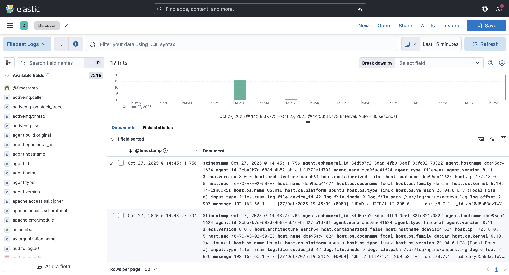

# Home Lab: NGINX Log Collection + Filebeat + ELK (Elastic Stack)

This project showcases a mini **SOC (Security Operations Center) pipeline** built entirely on my MacBook using Docker.  
I collect HTTP access logs from a containerized NGINX web server, ship them using **Filebeat**, store them in **Elasticsearch**, and visualize them in **Kibana** using **Lens dashboards**.

> This simulates log ingestion + parsing + visualization, exactly like a real SOC workflow.

---

## Architecture Diagram

+---------------+ +---------+ +---------------------+
| NGINX  | --->  | Filebeat  | ---> | Elasticsearch |
| (logs) |       | (shipper) |      | (storage/API) |
+---------------+ +---------+ +---------------------+

---> Kibana (dashboards)
---

## What This Lab Demonstrates

| Skill                        | Description |
|------------------------------|-------------|
| Log ingestion & parsing      | Filebeat harvests logs from inside Docker and forwards them
| to Elasticsearch             |
| Search & filtering           | Used Discover to query by timestamp, IP, status codes |
| Dashboarding & Analytics     | Created Kibana visualizations showing HTTP traffic trends |
| Threat analysis mindset      | Simulated 404 brute-force traffic and analyzed it visually |

---

## How to Run the Lab

### 1. Clone the repo
git clone https://github.com/hunterb516/home-cyber-labs.git
cd home-cyber-labs/docker

2. Start the stack
docker compose up -d
Wait ~60 seconds for Elasticsearch & Kibana to initialize.

3. Generate log activity
for i in {1..10}; do curl -sI http://localhost:8080 > /dev/null; done
for i in {1..5}; do curl -s http://localhost:8080/test > /dev/null; done

4. View logs in Kibana
Navigate to: http://localhost:5601
Go to: Discover → Filebeat Logs
(you should see incoming NGINX access logs in real time)

5. Stop the Lab
docker compose down

## Dashboard Preview
Dashboard includes:
- Total request count over time
- Breakdown by HTTP status code
- Spike detection visualization (404 flood attempts)
- Screenshot preview (example):

## Skills Demonstrated
- Built a full log pipeline (web server → Filebeat → Elasticsearch → Kibana)
- Parsed and visualized HTTP logs in Kibana Lens dashboards
- Simulated abnormal traffic (404 enumeration attempts) and validated detection
- Used Docker for isolated, reproducible infrastructure

## Project Structure
home-cyber-labs/
└── docker/
    ├── docker-compose.yml        # Elastic + Kibana + Nginx + Filebeat
    ├── nginx/
    │   └── logs/                 # Access logs harvested by Filebeat
    └── filebeat/
        └── filebeat.yml          # Log shipping config

