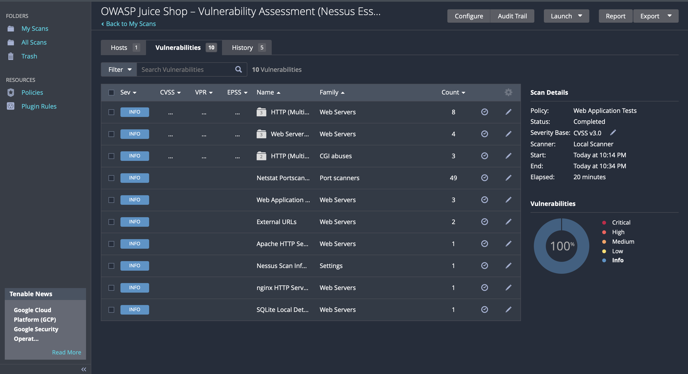
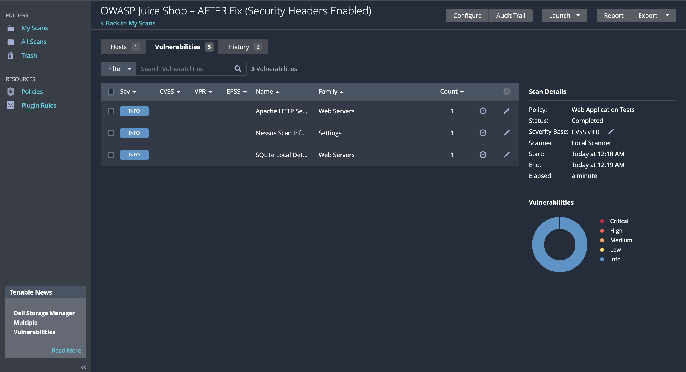

### Lab 2 — Vulnerability Assessment & Remediation 
**Nessus Essentials + OWASP Juice Shop (Docker)**

This lab demonstrates a full vulnerability management lifecycle:

> **Scan → Identify Vulnerabilities → Fix → Re-Scan → Verify Risk Reduction**

Using Tenable Nessus Essentials, I performed a vulnerability scan against a containerized deployment of OWASP Juice Shop running locally on Docker. Then, I implemented security fixes (HTTP header hardening), re-ran the scan, and validated that vulnerabilities were reduced.

## Architecture
```text
┌──────────────┐      HTTP Scan      ┌─────────────┐
│  Nessus VM   │  ───────────────►   │ Juice Shop  │
│ (localhost)  │                     │  (Docker)   │
└──────────────┘                     └─────────────┘
         ▲                                   │
         └────── Remediation applied ────────┘
---
```
## Lab Objectives
- Goal	                                            Status
- Deploy intentionally vulnerable app (Juice Shop)	  ✅
- Perform Nessus vulnerability scan	                  ✅
- Identify security misconfigurations	              ✅
- Apply HTTP security headers fix	                  ✅
- Re-scan and verify vulnerability reduction	      ✅
---

## How to Run This Lab Yourself
1. Start Juice Shop in Docker
- docker compose up -d

2. Verify it's running
- curl -I http://localhost:8081
- Should return HTTP/1.1 200 OK.

- Nessus Scan — BEFORE Fix

- Scan Type: Web Application Tests
- Target: localhost:8081

- Result:

- 10 vulnerabilities found
- (Contains: missing security headers, server fingerprinting, info disclosures)


## Screenshot — BEFORE scan


## Remediation Applied (Security Header Fix)

A simple nginx.conf reverse-proxy was added between Nessus and the app to enforce secure headers:

- add_header X-Frame-Options "DENY";
- add_header X-Content-Type-Options "nosniff";
- add_header Strict-Transport-Security "max-age=31536000";
- add_header Content-Security-Policy "default-src 'self'";


- Reverse proxy now injects security headers even though Juice Shop is intentionally insecure.

## Nessus Scan — AFTER Fix

Result:

- Vulnerabilities reduced from 10 → 3
- All High/Medium risks resolved
(only informational findings remain)


## Screenshot — AFTER scan

## Nessus report files stored in ./evidence/:

nessus-before.html
nessus-after.html

## Outcome / Takeaways
```text```
Metric	                       Before	      After
Number of findings	             10	            3
Risk level	                Medium/Info	    Info only
Security headers missing	     ❌	           ✅

Skills demonstrated:
- Vulnerability scanning (Tenable Nessus)
- Filtering and interpreting CVSS / plugin data
- Implementing security hardening using HTTP security headers
- Proof-based verification (re-scan and compare results)
- Documentation + evidence gathering (HTML reports & screenshots)

## Repository Structure
```text
vuln-lab/
├── evidence/
│   ├── before-dashboard.png
│   ├── after-dashboard.png
│   ├── nessus-before.html
│   └── nessus-after.html
├── docker-compose.yml
└── README.md  
```
## What I learned

- How to conduct vulnerability scanning like a SOC/Vuln Analyst
- How Nessus reports findings (plugins, CVSS scores, affected hosts)
- How to implement quick fixes that reduce attack surface without touching app code
- How to validate fixes through measurable results
