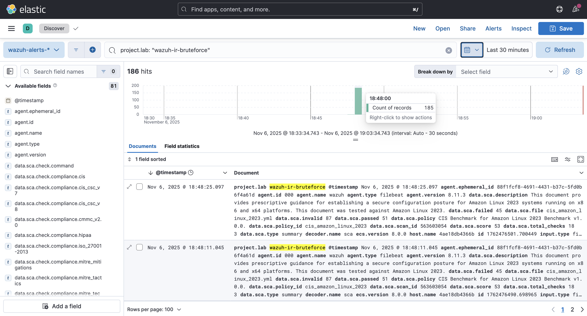
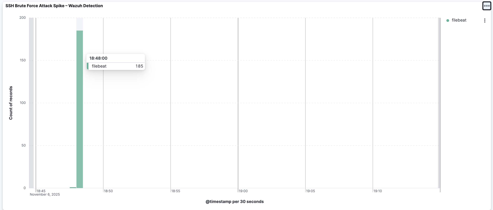

# Lab 3 — Intrusion Detection & IR: SSH Brute-Force (Wazuh + Elastic + Kibana)
**Goal:** simulate an SSH brute-force attack against a container host, detect it with **Wazuh**, ship alerts to **Elasticsearch**, and visualize the spike in **Kibana**—just like a SOC would during triage.

---

### What This Lab Shows 
- End-to-end SOC workflow: **generate attack → detect → investigate → visualize**
- Ability to **instrument** Docker services, forward alerts, and **build dashboards**
- Incident-response habits: **tagging evidence**, keeping a clean **README** + screenshots

---

### Architecture (Docker, all local on Apple Silicon)
```text
┌──────────────┐ alerts ┌──────────────────────┐
│ SSH Target │ ───────────────► │ Wazuh Manager │
│ (Ubuntu,22) │ │ + Filebeat → ES │
└──────┬───────┘ └─────────┬────────────┘
│ brute force (ssh) │
▼ ▼
Attacker Script Elasticsearch 8.x ──► Kibana (Lens/Dashboard)
```
---

### Quick Start (10–12 min)

1) **Bring up the stack**
```
cd wazuh-ir-lab
docker compose up -d

# Services: elasticsearch:9200, kibana:5601, wazuh manager, ssh-target:2222
Confirm Kibana is up
Open http://localhost:5601 (first boot may take ~60–90s).

# Generate brute-force attempts (against the ssh-target container)
- Requires an SSH client (installed by default on macOS)
- Replace wrong password attempts with a tight loop:
for i in $(seq 1 60); do
  ssh -p 2222 worker@localhost <<< "wrongpassword" 2>/dev/null
done

# Verify alerts in Kibana (Discover)
- Data view: wazuh-alerts-*
- KQL filter (if you set one in Filebeat/Wazuh enrichment):
project.lab: "wazuh-ir-bruteforce"

You should see Wazuh alerts (auth failures / brute-force rule hits).

# Build the spike visualization (Lens)
- Open Visualize → Lens
- X axis: @timestamp (auto bucket)
- Y axis: Count of records
- (Optional) Break down by: rule.name or agent.name
- Save as: SSH Brute Force Attack Spike – Wazuh Detection
- Add to Dashboard → save dashboard as: Incident Response – SSH Brute Force

# To Tear Down:
- docker compose down -v
```
# Evidence (screenshots)
**Place screenshots in ./evidence/ and use these filenames:**
- evidence/discover-bruteforce.png – Kibana Discover showing raw Wazuh alerts
- evidence/spike-bruteforce.png – Lens bar chart with the spike
- Here are mine:



## What I Learned

- How to build a full Incident Detection pipeline using **Wazuh + Elasticsearch + Kibana**
- How Filebeat ships logs into a SIEM pipeline and how Wazuh parses them into alerts
- How to simulate an SSH brute-force attack and observe the resulting log/event spike
- How to hunt for security events in Kibana using filters and KQL queries
    - (`project.lab: "wazuh-ir-bruteforce"`)
- How to build dashboards and visualizations showing attack activity over time
- How a SOC analyst moves through the IR workflow:
    - **Detect → Investigate → Visualize → Report**
- Learned the value of log centralization and alerting during incident response

# Why this matters
- Proves competency with SIEM data pipelines, alert triage, and dashboards
- Demonstrates practical IR thinking: create, detect, validate
- Shows I can produce evidence (screenshots, steps) a SOC lead can review quickly

# Lab Structure
```
wazuh-ir-lab/
├── docker-compose.yml
├── README.md
├── .gitignore
└── evidence/
    ├── discover-bruteforce.png
    └── spike-bruteforce.png
```
